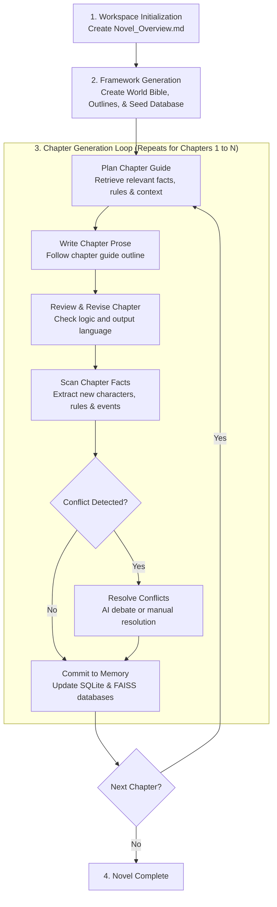
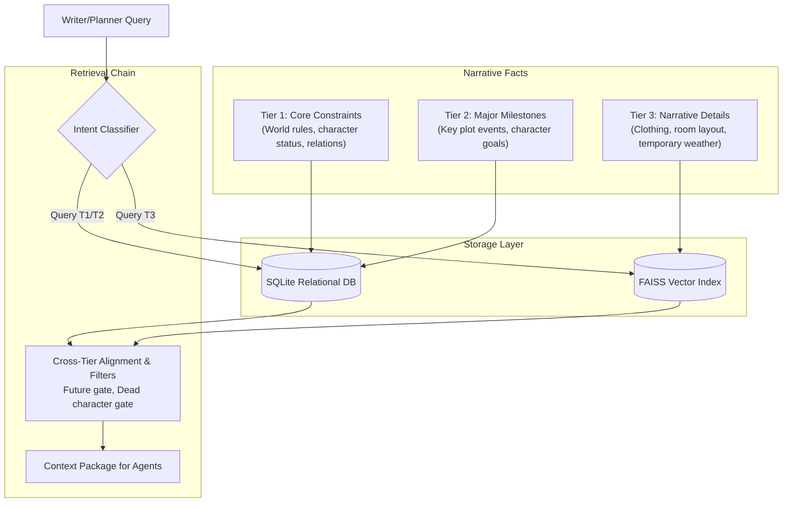

# AI Novel Writer

A multi-agent novel writing system designed to generate long-form novels by maintaining structured state for the world, characters, and plot. The system is built on the AI Team Team (ATT) [https://github.com/AI-Team-Team/AI-Team-Team](https://github.com/AI-Team-Team/AI-Team-Team) framework to manage chapter planning, text generation, consistency reviews, and database updates.

Many thanks to Gemini and GPT for their help!

> [!NOTE]
> The project already features a lot of really fun and innovative designs, with an even more groundbreaking architecture in the works. \
> (It’s still a little rough around the edges though 👀)

> [!TIP]
> If you notice any issues or have any suggestions and have the time, \
> please leave them in the Issues section. Thank you.

[👉 Project Architecture](docs/Architecture.md) | [👉 Flowchart](docs/Flowchart/README.md) | [👉 User Guide](docs/User_Guide.md) | [👉 Documents](docs/)

[](#)
[](LICENSE.txt)

## 🏛️ Writing Workflow

The system manages the story creation process through an initialization and generation workflow.



## 🌟 Key Features

### 1. Hybrid Memory System

To maintain continuity, narrative facts are categorized into three levels:

* **Tier 1 (Core Constraints)**: In-universe rules, character personality baselines, life/death status, identities, and core relationships.
* **Tier 2 (Major Milestones)**: Major chronological events, character goal updates, and long-term environmental changes.
* **Tier 3 (Narrative Details)**: Clothing details, room layouts, atmospheric descriptions, and temporary weather.



These facts are managed using a hybrid storage model:

* **SQLite Relational Database**: Enforces structured schemas and rules for Tier 1 and Tier 2 facts.
* **FAISS Vector Index**: Performs semantic retrieval for Tier 3 details.
* **Context Retrieval Funnel**: Retrieves state using a gated pipeline:
  $$\text{Query Intent Classification} \rightarrow \text{SQLite Prefilter} \rightarrow \text{FAISS Semantic Lookup} \rightarrow \text{Cross-Tier Alignment} \rightarrow \text{Context Package}$$
  * *Future Gate*: Filters out details from future chapters to prevent narrative leaks.
  * *Dead Character Gate*: Filters out retrieved semantic chunks mentioning deceased characters when checking constraints.
  * *Temporal Boost*: Prioritizes facts that are chronologically closer to the target chapter.

### 2. Autonomous ATT Committee Debates

Using the AI Team Team (ATT) [https://github.com/AI-Team-Team/AI-Team-Team](https://github.com/AI-Team-Team/AI-Team-Team) framework, agents form dynamic committees to automate review and conflict resolution:

* **Planning Committee**: Planner and Critic refine the chapter guide.
* **Editorial Committee**: Writer and Critic execute revision rounds to polish prose.
* **Conflict Resolution Committee**: Historian, Writer, and Planner agents debate when database contradictions occur (e.g. character resurrection).
* **Supervisory Auditing**: A 3-AI team audits logs to identify and prevent discussion deadlocks.

### 3. Interruption Recovery

The system validates state integrity during startup or recovery:

* Validates generated files physically (file existence, non-zero size) and structurally (JSON/JSONL parsing and validation).
* Checks database state for completeness using the SQLite `chapter_commits` status.
* Purges incomplete files and commits before resuming from the last complete chapter.
* Rebuilds the FAISS vector index from SQLite database metadata automatically if index files are missing or corrupted.

### 4. Alternate Buffer Dashboard

A terminal user interface implemented using `rich.live` inside the terminal's alternate buffer displays active agent states, agent thoughts, tool execution, and system logs.

## 📁 Novel Directory Structure

The runtime generated `novel/` directory contains all generated text drafts, outlines, world bibles, and logs:

```plaintext
novel/
├── Novel_Overview.md       # Initial story blueprint created during `--init`
├── main_text/              # Generated novel prose drafts
│   └── chapters/           # Markdown files for each chapter (e.g. chapter_001.md)
├── frame/                  # Outline and constraints directory (Writing Contract)
│   ├── world/              # Contains the world bible (world_bible.md)
│   ├── plot/               # Outlines (plot_outline.md, detailed_plot_outline.md)
│   ├── chapter_guides/     # Writing guides generated for each chapter (chapter_n_guide.md)
│   └── archives/           # Compact archives (characters_compact.md, world_rules_compact.md)
├── process/                # Fact extractions, reviews, and dynamic debate transcripts
│   ├── critiques/          # Critic reviews of chapter guides/text
│   ├── discussions/        # Debate transcripts and the index file (discussion_index.jsonl)
│   │   ├── conflict_{id}_resolution_discussion.md
│   │   └── chapter_{n}_text_discussion.md
│   ├── facts/              # Extracted facts (chapter_n_facts.json, chapter_n_facts_summary.md)
│   ├── reviews/            # Critic review files
│   └── revisions/          # Prose revision files
└── Discussion_Log/         # Sub-agent execution logs (All_Discussion.log, chapter_n_Discussion.log)
    └── att/                # Isolated logs for dynamic teams ({team_id}.log)
```

## 🛠️ Installation & Setup

### Prerequisites

* **Python 3.10+**
* An API key for **Google Gemini** or an **OpenAI-compatible** endpoint.
* An embedding service (e.g. OpenAI `text-embedding-3-small` or local `nomic-embed-text` server).

### Installation Steps

1. **Clone the repository and enter the directory**:

   ```bash
   git clone https://github.com/AI-Team-Team/AI-Novel.git
   cd AI-Novel
   ```

2. **Initialize the Virtual Environment**:

   ```bash
   python -m venv venv
   source ./venv/bin/activate
   pip install -r requirements.txt
   ```

## ⚙️ Configuration Decoupling

The configuration is divided into two separate files to decouple agent roles from physical API backends:

### 1. `config/ai_model_config.yaml`

Register your API keys, base URLs, and parameters under named keys:

```yaml
gemini_flash:
  model_type: "llm"
  api_type: "gemini"
  api_key: "${GEMINI_API_KEY}"
  model_name: "gemini-1.5-flash"
  enabled: true

openai_embed:
  model_type: "embedding"
  api_type: "openai"
  api_key: "${OPENAI_API_KEY}"
  base_url: "https://api.openai.com/v1"
  model_name: "text-embedding-3-small"
  enabled: true
```

### 2. `config.yaml`

Map agent roles to your registered model keys and customize workflow variables:

```yaml
models:
  primary_model_type: "gemini"
  architect_model: "gemini_flash"
  planner_model: "gemini_flash"
  writer_model: "gemini_flash"
  critic_model: "gemini_flash"
  scanner_model: "gemini_flash"
  embedding_model: "openai_embed"

workflow:
  language: "en"                      # Target novel language ("en" or "zh-CN")
  world_discussion_rounds: 2          # Bounded world bible review rounds
  chapter_guide_discussion_rounds: 2  # guide review rounds
  chapter_text_discussion_rounds: 2   # prose review rounds
  conflict_discussion_rounds: 2       # Conflict resolution committee rounds
```

## 🚀 Execution Guide

Always activate the virtual environment before running commands:

```bash
source ./venv/bin/activate
```

### Step 1: Initialize the Story Workspace

Create the core directories and the draft overview:

```bash
python src/main.py --init
```

*Action Required*: Open the newly generated `novel/Novel_Overview.md` and fill in your story details, character summaries, and plot targets.

### Step 2: Establish the World Frame

Run the initialization bibles and plot outlines:

```bash
python src/main.py --start
```

This triggers the Architect and Planner agents to:

1. Generate the **World Bible** (`novel/frame/world/world_bible.md`).
2. Generate the **High-Level Plot Outline** (`novel/frame/plot/plot_outline.md`).
3. Generate the **Detailed Plot Outline** (`novel/frame/plot/detailed_plot_outline.md`).
4. Extract seed facts to initialize the SQLite databases and FAISS indexes.

### Step 3: Run the Continuous Generation Loop

Generate chapters in a row using automatic mode:

```bash
# Generate 5 chapters starting from Chapter 1
python src/main.py --auto 1 5
```

*AI Conflict Resolution*: You can add the `--ai-resolve-conflicts` flag to automatically trigger the 3-AI debate panel when blocking constraints are encountered:

```bash
python src/main.py --auto 1 5 --ai-resolve-conflicts
```

### Step 4: Step-by-Step Manual Operations (Optional)

If you want to intervene or review steps individually:

* **Plan a Chapter**: `python src/main.py --plan 1` (Creates the Chapter Guide)
* **Write & Review**: `python src/main.py --write 1` (Generates prose and executes editorial critiques)
* **Scan Facts**: `python src/main.py --scan 1` (Extracts chapter details into DB)

### Step 5: Advanced Database Maintenance

* **List Active Database Conflicts**:

  ```bash
  python src/main.py --conflicts-triage
  ```

* **Resolve a Conflict Manually**:

  ```bash
  python src/main.py --resolve-conflict <CONFLICT_ID> <keep_existing|apply_incoming>
  ```

* **Replay a Failed Commit**:

  ```bash
  python src/main.py --failed-commits
  python src/main.py --replay-commit <COMMIT_ID>
  ```

* **Rebuild the Vector Search Index**:

  If you switch embedding models or need to re-index, run:

  ```bash
  python src/main.py --rebuild-vectors
  ```

## 📄 License

Distributed under the Apache License 2.0. See `LICENSE.txt` for details.
