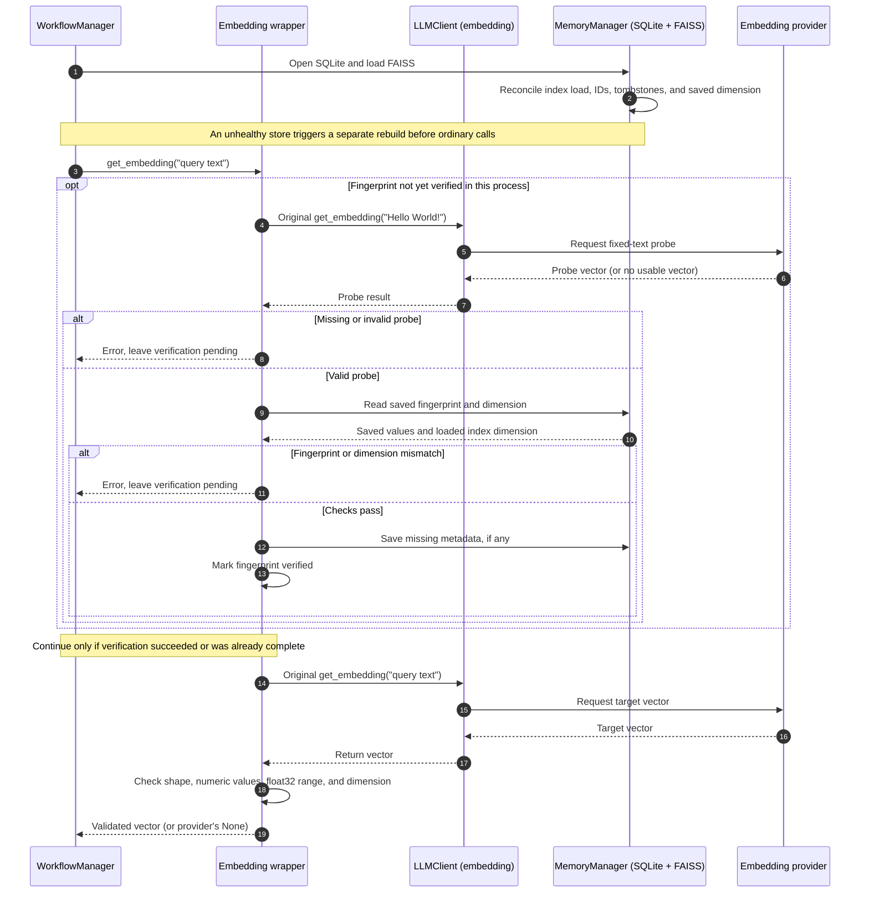

# Dynamic Embedding Dimension & Fingerprint Validation System

This design document describes how AI-Novel discovers embedding dimensions, checks provider output against an existing vector store, and rebuilds FAISS without silently losing searchable facts.

## 1. Context & Motivation

Earlier versions required an embedding dimension in configuration (for example, `dim: 768`). This created three problems:

1. **Redundancy and mismatch risk:** A user changing models also had to update a separate dimension setting.
2. **Incompatible vector spaces:** A new model may produce a different dimension, or different vectors at the same dimension. Either case can make an existing FAISS index unusable or its results misleading.
3. **Validation cost:** Embedding a fixed probe before every request would add provider calls, latency, and possibly charges.

The design therefore combines dimension autodetection, a lazy fixed-text fingerprint check once per process, validation of every returned vector, and a separately controlled rebuild. The fingerprint can detect materially changed output; it does **not** prove which model produced that output. Backend drift can also change it.

## 2. System Architecture & Component Interaction

`WorkflowManager` wraps the embedding `LLMClient.get_embedding` method. `MemoryManager` owns SQLite metadata and the FAISS index. SQLite records the confirmed dimension and fingerprint; the loaded FAISS index has its own actual dimension. Startup reconciliation compares these rather than assuming either is correct by itself.

The diagram shows the ordinary call path. If startup reconciliation requests a rebuild, `WorkflowManager` probes the provider and runs the rebuild before the first ordinary call.

## 3. Core Mechanisms

### 3.1. SQLite Metadata and FAISS Dimension

Model configuration does not require a dimension. `schema_meta.embedding_dim` stores the confirmed dimension as text. `MemoryManager` reads it when opening SQLite; loading an existing FAISS file sets the in-memory dimension from `index.d`. Reconciliation then checks that the saved and loaded dimensions agree, including for an empty index. Neither a zero vector count nor a default constructor dimension is evidence of the provider's actual dimension.

On a new project, the first valid ordinary probe may save a missing dimension and fingerprint. The first semantic write creates a missing FAISS index using its actual vector dimension. An empty rebuild instead requires a validated provider probe (or an explicit `target_dim` from a low-level caller); it must not fall back to 768.

### 3.2. Lazy Process-Run Fingerprinting

1. On startup, `_fingerprint_verified` is `False`.
2. Before the first ordinary embedding request, the wrapper calls the original client for `"Hello World!"`. A missing, malformed, non-finite, or float32-unrepresentable probe raises a user-facing error and leaves the flag `False`, so another call can retry.
3. A valid probe is compared with the stored JSON fingerprint using `numpy.allclose(..., atol=1e-5)` and checked against the saved dimension and loaded FAISS dimension. A malformed stored value or mismatch also leaves the flag `False`.
4. Only after these checks succeed does the wrapper write missing metadata and mark this process verified. Subsequent ordinary calls skip the fixed-text request.

The comparison tolerates small numeric differences, but it cannot distinguish a changed model from provider-side output drift. A mismatch calls for inspection of the configured provider and model before deciding to rebuild; it is not an automatic authorization to replace the index.

### 3.3. Continuous Local Vector Validation

Every non-`None` vector returned by the wrapper must be one-dimensional, nonempty, numeric, finite, representable as FAISS `float32`, and the expected length. The expected dimension comes from the loaded index, then saved SQLite metadata, then the in-memory value. The wrapper returns a normalized list. These checks are local but inspect the vector's elements; they are not a zero-cost length check. Direct `MemoryManager.add_semantic_fact` calls also reject malformed nonempty vectors before writing.

If the provider returns `None` for a read-only semantic query, retrieval can continue without that search. If it returns no embedding for a semantic detail during a fact-write batch, the write raises an error so the caller can roll back and retry rather than silently omitting the detail.

### 3.4. Startup Reconciliation

`MemoryManager.reconcile_vector_store()` checks index-load errors, active SQLite IDs against the FAISS count and contiguous IDs, non-negative IDs still occupied by soft-deleted rows, and the saved dimension against the loaded index. An inconsistency requests an automatic rebuild when FAISS is available. A missing or corrupt index does not cause AI-Novel to delete its SQLite source metadata.

If the provider cannot supply the probe or all required source embeddings, automatic recovery fails closed and stops workflow startup. It records a failed rebuild and skipped-row diagnostics where applicable, but does not replace an existing index or deactivate active metadata.

### 3.5. Safe Migration Flow (Rebuilding Vectors)

`--rebuild-vectors` is the explicit path for switching embedding spaces or repairing an inconsistent store:

1. `WorkflowManager.rebuild_vector_index()` sets process verification back to pending and asks the original embedding client for a validated `"Hello World!"` probe **before** modifying the vector store. It does not use the former `_bypass_all_checks` flag.
2. `MemoryManager.rebuild_vector_index_from_metadata()` receives the probe dimension and fingerprint, embeds active `vector_metadata` rows, and checks each result against that dimension. An empty index is created with the probe's dimension.
3. By default, any missing, malformed, or mismatched source embedding fails the run. `vector_rebuild_runs` and `vector_rebuild_audit` retain the failure and per-row reasons; the prior index and active source rows remain unchanged. A low-level caller may explicitly choose `allow_partial=True`, which soft-deletes skipped rows; the CLI and automatic recovery do not choose it.
4. On success, the staged FAISS replacement, reindexed metadata, saved dimension, and supplied fingerprint are coordinated in the SQLite/FAISS batch. The run is marked complete, and the process verification flag becomes `True`. A failed rebuild leaves the flag pending.

A new project's initial validation can also populate missing fingerprint and dimension metadata; rebuilding is not the only operation that ever writes these keys. For an existing indexed project, replacing its confirmed fingerprint and dimension is part of a successful explicit rebuild.

### 3.6. Soft-Deleted Metadata Boundary

Ordinary rebuilds preserve existing soft-deleted rows, including their source fields and creation timestamps, without embedding their content or adding it to FAISS. Active rows receive contiguous non-negative IDs. Existing negative tombstone IDs remain when possible; legacy non-negative tombstone IDs move to unused negative IDs, with remaps recorded in the rebuild audit. `include_deleted=True` counts and audits all existing tombstones as `PRESERVED`; it does **not** reactivate them.

Vector reset also moves retained rows into negative-ID space before a new empty FAISS index can reuse ID 0. A direct low-level vector write normalizes legacy non-negative tombstones in its current transaction before allocating a new ID. If a caller explicitly allows a partial rebuild, skipped active rows become new negative-ID tombstones. Restoring a deleted fact would require a separate, confirmed workflow, which is not implemented; rebuild never performs an implicit restore.

## 4. SQLite Schema Metadata Specs

| Location | Description | Format |
| :--- | :--- | :--- |
| `schema_meta.embedding_dim` | Confirmed dimension of the embedding space. | Positive integer stored as text. |
| `schema_meta.embedding_fingerprint` | Vector for `"Hello World!"` from the confirmed provider output. | JSON array of finite numbers. |
| `vector_rebuild_runs` | Rebuild status, counts, target dimension, and error. | One row per attempted rebuild. |
| `vector_rebuild_audit` | Rebuilt, skipped, and preserved-row outcomes, including ID remaps. | Rows linked to a rebuild run. |

## 5. Benefits and Limits

* **Less configuration:** Users need not maintain a separate dimension setting.
* **Safer writes and recovery:** Dimension and vector-shape checks reject incompatible output; failed default rebuilds preserve active source facts and existing searchable state where present.
* **Bounded ordinary-call overhead:** After one successful fixed-text verification in a process, ordinary calls perform only local vector checks. An explicit or automatic rebuild makes additional provider calls for source rows.
* **Not an identity guarantee:** Matching dimension and fingerprint do not prove that every future embedding comes from an unchanged model, and a changed fingerprint alone does not prove a model switch.
