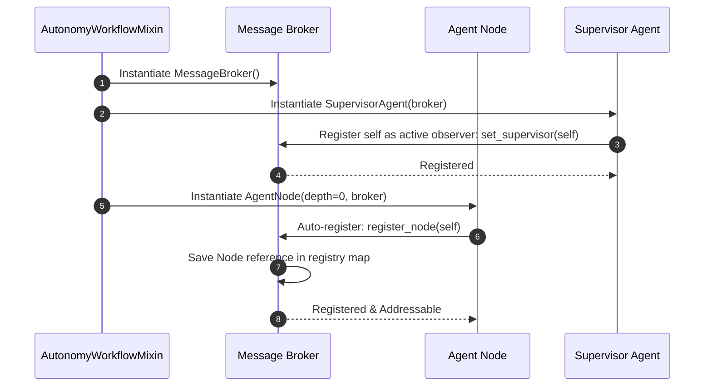
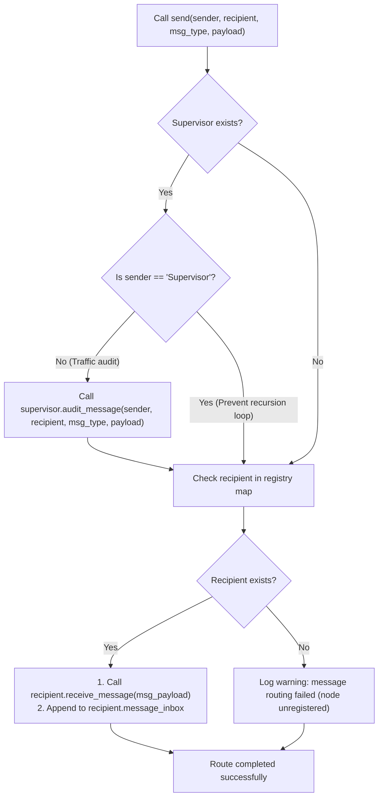

# Message Broker & Sibling Routing Flowchart

This document details the registration sequence and P2P routing mechanisms managed by the `MessageBroker`.

## 1. Sequence of Node Registration & Broker Lifecycle

This sequence diagram outlines the creation, registration, and subscription of nodes during the initialization of the Autonomy Suite:

## 2. P2P Sibling Message Routing Flowchart

This flowchart outlines the logic executed inside `MessageBroker.send` when a node attempts to transmit a message payload:

