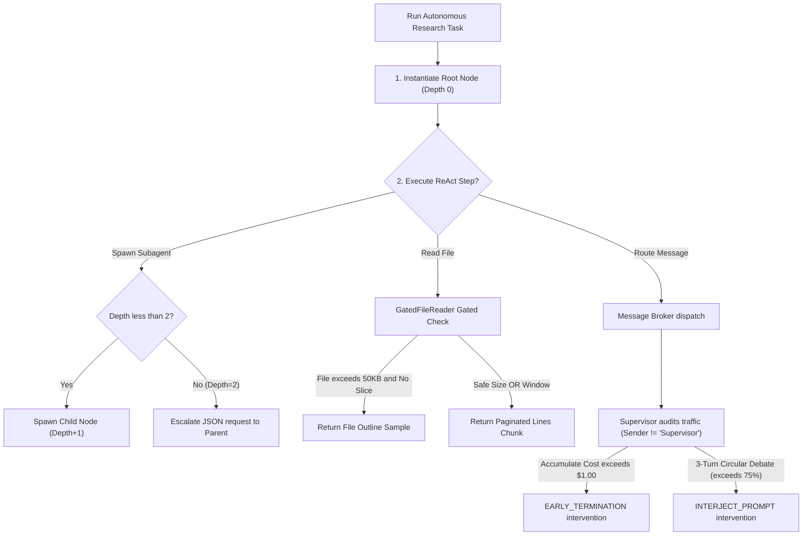

# AI Autonomy Suite Flowcharts

This directory contains detailed technical flowcharts and Mermaid sequencing diagrams detailing the operational control flows of the **AI Autonomy & Dynamic Subagent Delegation Suite**.

## Flowchart Index

Please refer to the following documents for granular flow diagrams:

1. **[Spawning & Escalation Channels](Spawning_Escalation.md)**: Details the hierarchical agent tree, depth boundaries (max depth = 2), and the bidirectional JSON-based escalation process when grandchild nodes request subagents.
2. **[Gated Paginator Reading](Gated_Reading.md)**: Visualizes the context protection pre-filters, outline generationSamples, and paginated line-numbered chunk slicing logic.
3. **[Message Broker & Sibling Routing](Broker_Sibling_Routing.md)**: Sequences the registration of nodes and collaborative peer-to-peer P2P message bus traffic between sibling specialist panels.
4. **[Supervisor Agent Audits & Interventions](Supervisor_Audit.md)**: Diagrams the observer agent's token cost tracking, sliding 3-turn debate lexical deadlock similarity checking, and command interventions (`INTERJECT_PROMPT`, `EARLY_TERMINATION`).

## Unified High-Level Flow Overview

The Autonomy Suite coordinates the interaction of these four systems in a decoupled, event-driven pattern:

