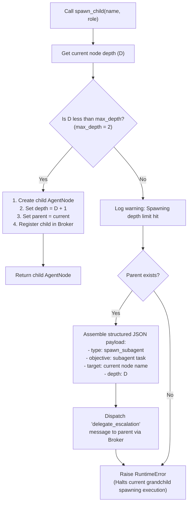
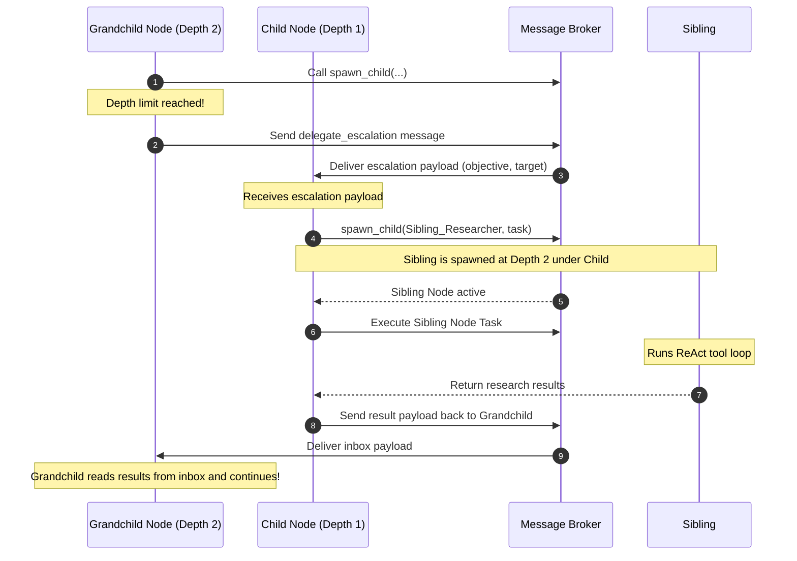

# Spawning & Escalation Channels Flowchart

This document details the control flow of the hierarchical subagent spawning tree and the bidirectional JSON-based escalation process.

## 1. AgentNode Spawning Gate Flowchart

This flowchart outlines the logic executed when an agent node attempts to spawn a subagent:

---

## 2. Parent-Proxy Escalation Processing Sequence

This sequence diagram illustrates how a Grandchild (Depth 2) node escalates a task to a Child (Depth 1) node, which acts as a proxy:

