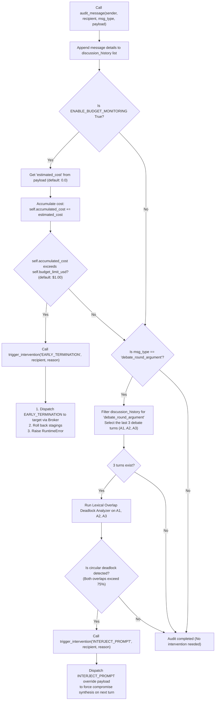
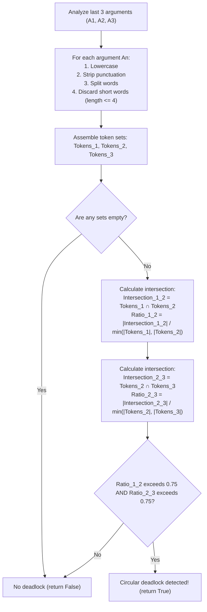

# Supervisor Agent Audits & Interventions Flowchart

This document details the audit channels, cost boundaries, and lexical overlap checks executed by the non-participating `SupervisorAgent`.

## 1. Broker Message Auditing Logic Flowchart

This flowchart outlines the sequence executed on every message audit step inside the Supervisor:

## 2. Lexical Overlap Deadlock Analyzer Algorithm

This flowchart visualizes the exact mathematical word token check used to detect circular debates:

