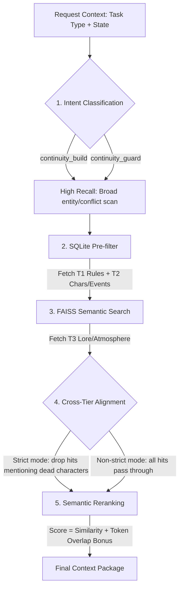
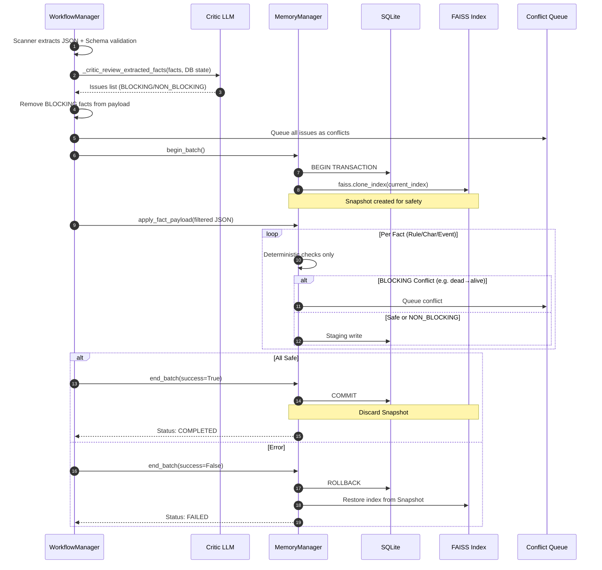

# Memory & Retrieval System

This document details the multi-tier retrieval funnel and the atomic commit/rollback mechanism used to ensure narrative consistency.

## 1. Context Retrieval Funnel (The Narrowing Funnel)

The system avoids "context pollution" by filtering and ranking facts through a 5-step pipeline.

### Reranking Heuristics

* **Entity Bonus**: +0.35 score for each focus entity token match.
* **Location Bonus**: +0.50 score for exact location match.

## 2. Atomic Chapter Commit (Scanner ↔ Memory)

Ensures that "dirty" facts from a bad scan don't corrupt the long-term memory.

## 3. Conflict Detection

Conflict detection uses a two-layer approach:

### Layer 1: Deterministic Checks (memory.py)

* **Character Status Guard**: Blocks dead→alive status change (`BLOCKING`). Protects immutable identity fields.
* **Timeline Dead Character Flag**: Events mentioning dead characters are inserted but flagged `NON_BLOCKING` for Critic review.
* **Exact Deduplication**: Rules and events with identical payloads return existing ID without re-insert.
* **Relationship Type Change**: Queued as `NON_BLOCKING` conflict, existing type preserved.

### Layer 2: LLM Critic Review (workflow.py)

Performed before DB commit via `_critic_review_extracted_facts()`:

* **Input**: Extracted facts + DB state snapshot (characters, strict rules, recent events) + chapter text.
* **Detection**: Semantic/logical contradictions (strict rule violations, causal impossibilities, dead character active participation vs memorial).
* **Output**: `BLOCKING` facts removed from payload; `NON_BLOCKING` facts kept; all issues queued as conflicts.
